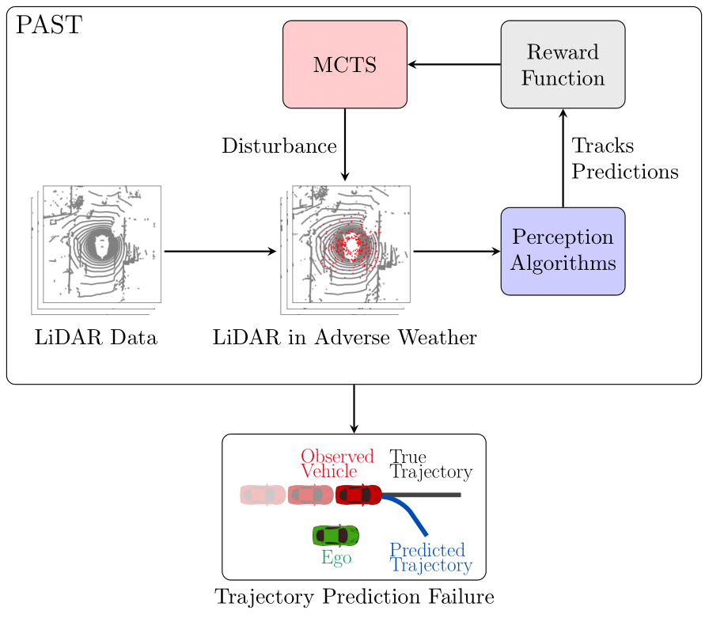
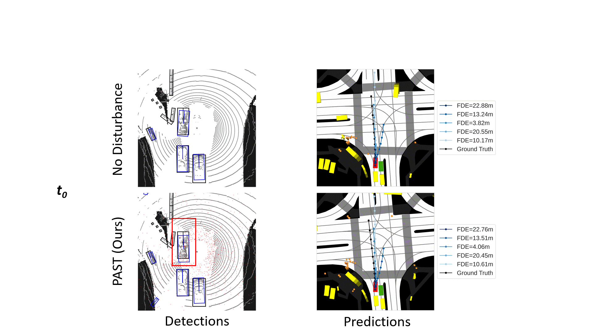

# PerceptionAdaptiveStressTesting

Adaptive Stress Testing (AST) of Lidar-based perception systems for autonomous vehicles under adverse weather conditions. We formulate Perception Adaptive Stress Testing (PAST) and validate a sample Lidar-based perception system over the NuScenes driving dataset.




**Approach:** Our proposed PAST framework for validation of tracking and prediction stages of an AV perception systems under adverse weather conditions is illustrated above. Red points indicate disturbances to the perception system caused by LiDAR beams reflecting off of airborne particles. Monte Carlo Tree Search (MCTS) controls how sequences of disturbances are added to the system to cause failures in perception tasks that depend on detections aggregated over time, such as object tracking and trajectory prediction. PAST seeks to find the most likely failures in these sequential perception system tasks.




**Results** The above animation shows a particular failure event found using our proposed approach. Objecy detections and the top 5 most confident predicted trajectories are shown in blue while ground truth is shown in black. Red points in the lidar point cloud represent the most likely adverse weather disturbance introduced by our method. The failure occurs in the vehicle highlighted in red. The legend to the right shows the final displacement error of each prediction. The ego vehicle is highlighted in green. PAST finds a sequence of disturbances leading to failure. The predicted trajectory incorrectly indicates that the ego vehicle will be cut off in the next six seconds. Such incorrect predictions could cause unsafe behaviors in the ego vehicle, and can even result in accidents. Since our method can detect such possible failures, it can inform future development of robust perception systems for autonomous vehicles.


<!-- ## Setup
This project requires python 3.6 and pytorch 1.3. In a new `conda` environment, you can install these with:

```conda install python=3.6 pytorch=1.3 cudatoolkit=10.0 cudnn boost mayavi importlib_metadata importlib_resources```

And ensure:
>torch._C._GLIBCXX_USE_CXX11_ABI

is True

Next install the NuScenes python devkit. Follow the instructions here: https://github.com/nutonomy/nuscenes-devkit.

The nuscenes devkit also includes instructions on downloading the NuScenes dataset. To run this project, you will need the following data:
* [NuScenes v1.0-mini](https://github.com/nutonomy/nuscenes-devkit#nuscenes-setup)
* [Map expansion](https://github.com/nutonomy/nuscenes-devkit#map-expansion)


Now follow the installation instructions for https://github.com/traveller59/spconv
NOTE:
I had to add to the CMakeLists.txt at the top of the file
	set(CMAKE_CUDA_COMPILER /usr/local/cuda-10.0/bin/nvcc) 
And add this to setup.py:
 '-DCMAKE_CUDA_COMPILER=/usr/local/cuda-10.0/bin/nvcc', 
right after the line with '-DPYBIND11_PYTHON_VERSION={}'.format(PYTHON_VERSION)

Now follow the installation instructions for: https://github.com/open-mmlab/OpenPCDet/tree/0642cf06d0fd84f50cc4c6c01ea28edbc72ea810

and download the PV-RCNN_8369.pth pre-trained model located: https://drive.google.com/file/d/1lIOq4Hxr0W3qsX83ilQv0nk1Cls6KAr-/view

Make a directory within OpenPCDet and save the model to "OpenPCDet/Models/pv_rcnn8369.pth" -->

<!-- Now everything should be ready to run. Run the following
python ObjectDetect.py --data_path PATH/TO/KITTI/DATA/velodyne_points/data/ -->

<!-- This will create input images in a directory InputImages/ -->

<!-- # Trajectory prediction
After the input images are created they are in the format needed for trajectory prediction on covernet: 
https://github.com/nutonomy/nuscenes-devkit/blob/master/python-sdk/tutorials/prediction_tutorial.ipynb
The link above is to a tutorial on how to predict trajectories. Covernet expects a map layered onto the input images of cars, however we do not have
that data so we have elected to create an empy map representation which will eliminate the map on nuscenes data.

For the agent state vector that information can be pulled from the oxts/ files in the ego vehicle. -->
